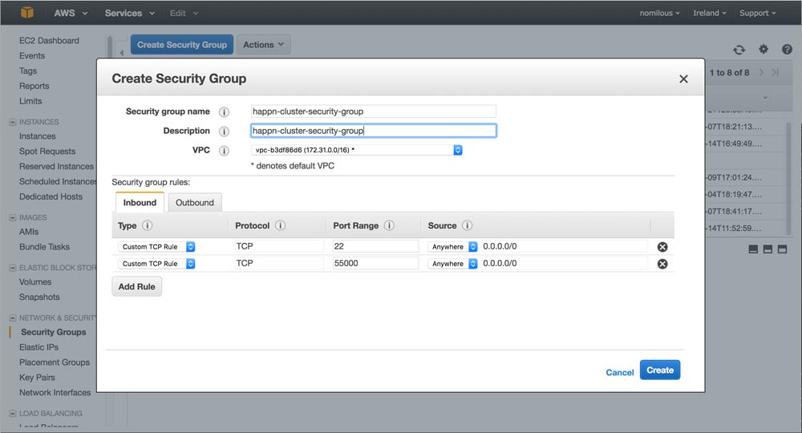
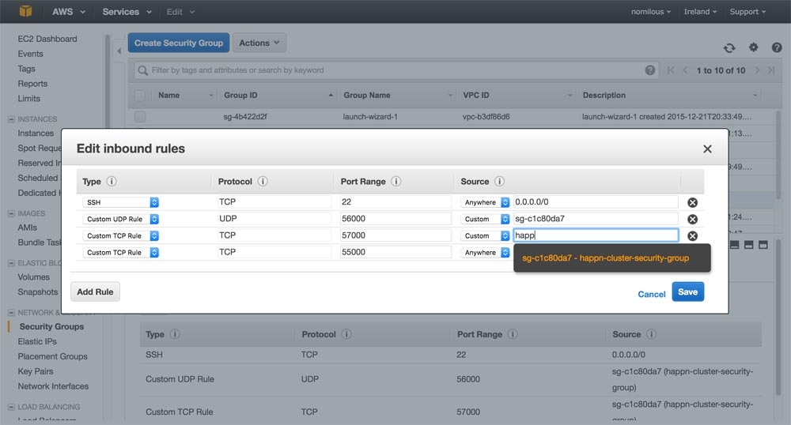
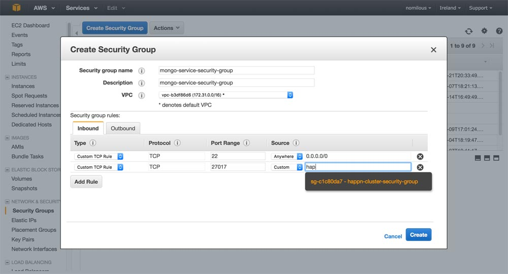
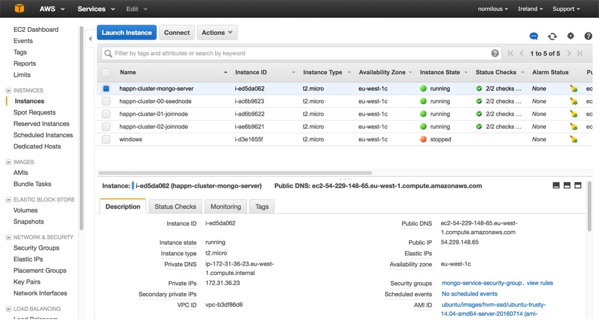
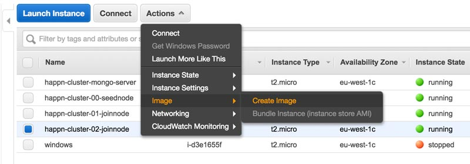
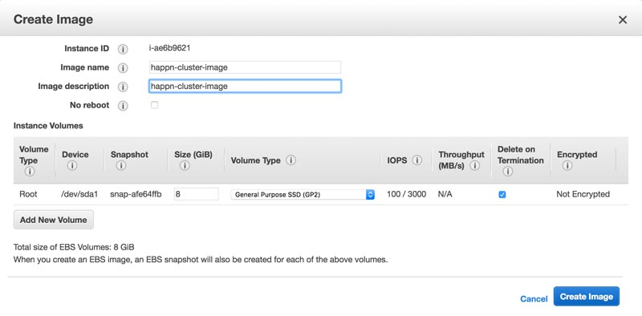
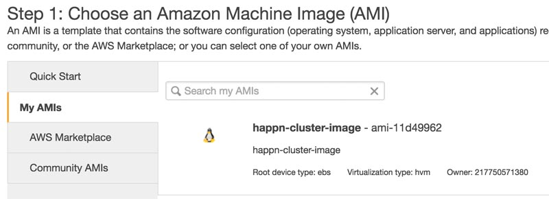
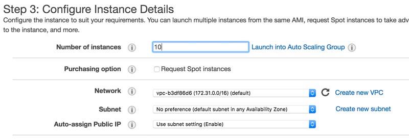
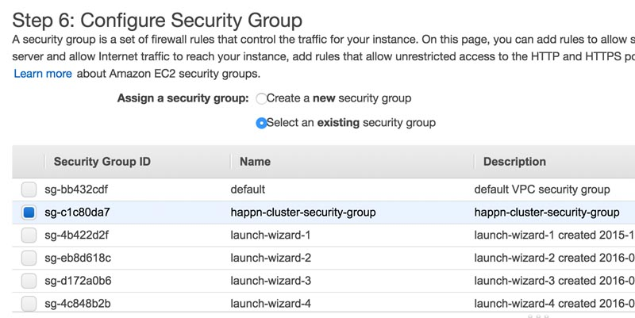
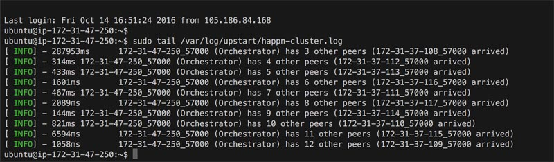

# happn-cluster-aws-example

AWS example setup [happn cluster](https://github.com/happner/happn-cluster).

## Step 1: Create AWS security groups

### Group for cluster nodes

Create a group called "happn-cluster-security-group"

Enable all TCP access to cluter proxy port (55000) and ssh:



Save and re-open to add self referencial rules. Allow connections to membership port (UDP 56000) and happn server (57000) **only from other members in the same security group**:



### Group for mongo server

Create a group called "mongo-service-security-group".

Assign ssh to all and mongo (27017) to only members in the previous group "happn-cluster-security-group"




## Step 2: Create mongo server

Using **Ubuntu Server 14:04** *(has upstart instead of systemd)*

**Remember to select the  "mongo-service-security-group" in the applicable step.**

Login and install mongodb once the server is up:

```bash
ssh -i ~/.ssh/aws-linux.pem ubuntu@54.154.244.174

sudo -s
apt-get update
apt-get install mongodb -y
vi /etc/mongodb.conf

## change to listen on all ports
bind_ip = 0.0.0.0
##

restart mongodb
netstat -an | grep 27017 # confim listening 0.0.0.0

# get mongo server's address for MONGO_URL env var later
ifconfig eth0
```

Remember to name/label the host before things get confusing.


## Step 3: Create 3 happn cluster servers

1. will be the seed node for bootstrapping the cluster
2. will be a join host (included in the list of hosts-to-join in all future cluster nodes)
3. will be the same as 2

**Remember to select the  "happn-cluster-security-group" in the applicable step.**

Name/Label all hosts appropriately.



Named "happn-cluster-00-seednode", "happn-cluster-01-joinnode" and "happn-cluster-02-joinnode". 

Once all 3 hosts are running, login and setup the happn cluster.

Tip: `csshX` enables a single command input into multiple ssh sessions

```bash
brew install csshX

csshX --ssh_args "-i /Users/me/.ssh/aws-linux.pem" ubuntu@54.229.29.208 ubuntu@54.194.71.178 ubuntu@54.171.205.100
```

Perform the following on all 3 nodes

```bash
sudo -s
apt-get update
apt-get install git build-essential -y

# install nodejs
# https://nodejs.org/en/download/package-manager/#debian-and-ubuntu-based-linux-distributions (for updates to below)

curl -sL https://deb.nodesource.com/setup_6.x | sudo -E bash -
apt-get install nodejs
node --version

# create user to run cluster as

adduser --disabled-password happn

# install cluster software (as user)

su happn
cd ~/
git clone https://github.com/happner/happn-cluster-aws-example.git # this repo
cd happn-cluster-aws-example/
npm install
exit # back to root

# move the init script into position and adjust

cp /home/happn/happn-cluster-aws-example/init/happn-cluster.conf /etc/init
vi /etc/init/happn-cluster.conf
```

Adjust the happn-cluster.conf file. Make the same changes on all 3 nodes (except for the IS_SEED flag)

```bash
# happn-cluster

start on runlevel [2345]
stop on runlevel [016]

respawn

env HAPPN_IFACE=eth0
env ADMIN_PASSWORD=mixai2TaZaquoos7 # <---- leave this exactly the same...
                                    #       so that i can have may way with your cluster

env MONGO_URL=mongodb://172.31.36.23:27017/example-cluster # <----- insert mongo server ip
env MONGO_COLLECTION=example-cluster

env CLUSTER_NAME=example-cluster

env SWIM_IFACE=eth0
env JOIN_HOST_1=172.31.47.250:56000 # <--------- point at seed node
env JOIN_HOST_2=172.31.47.249:56000 # <--------- point at join node 1
env JOIN_HOST_3=172.31.47.248:56000 # <--------- point at join node 2

env IS_SEED=0                       # <---------- set to 1 on node marked as seed

chdir /home/happn/happn-cluster-aws-example
setuid happn
setgid happn

exec bin/cluster-server # logs to /var/log/upstart/.. (in a manner supporting rotation)

```

Start the seed node first. Then the other 2

```bash
start happn-cluster
tail -f /var/log/upstart/happn-cluster.log
```


## Step 4: Create image

Additional nodes in the cluster can use the same config as that of either of the **join nodes**.

Create an image from one of them called "happn-cluster-image"






## Step 5: Create multiple additional cluster nodes

Wait for the image created in step 5 to become available. See images/AMIs menu.

Launch 10 instances of the image from the usual launch menu, except selet image from "My AMIs"





Don't forget to assign to the "happn-cluster-security-group"



10 new cluster nodes shortly appear in log




## Step 6: Load Balancer

